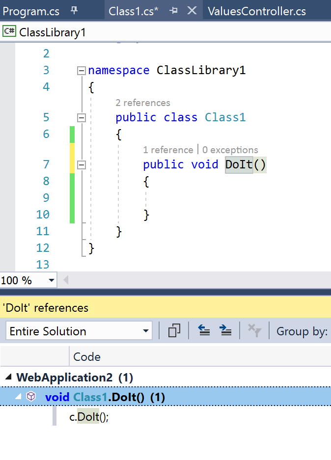

# Find references 

## Description
If you want to quickly see which references a certian method (or class) has, you can list them using SHIFT + F12. Looking closly you will realize that this is kind of the opposite of "Go to Definition". And therefore the shortcut is basically "inverted" to SHIFT + F12.

## Guidance

1. Open up a C# Project in Visual Studio.
2. Place your cursor on a methodname.
3. Hit (SHIFT + F12).
4. You will get a list of references displayed.

