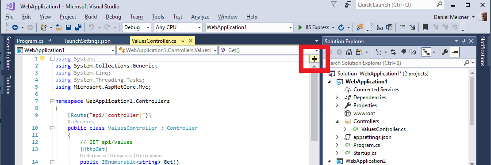

# Split editor horizontal

## Description
You can split your editor horizonally. This allows you to edit the same file in two different sections without the need to scroll up and down.

## Guidance
1. Open a file in Visual Studio. 
2. In the upper right corner of the editor right on top of the scroll bar, there's a little button. 
3. Click the button, hold it pressed and drag it down.
3. Your editor will be split, you can choose the ratio between the two edtior panes freely.
4. To close the second pane just draw the border all the way up.

