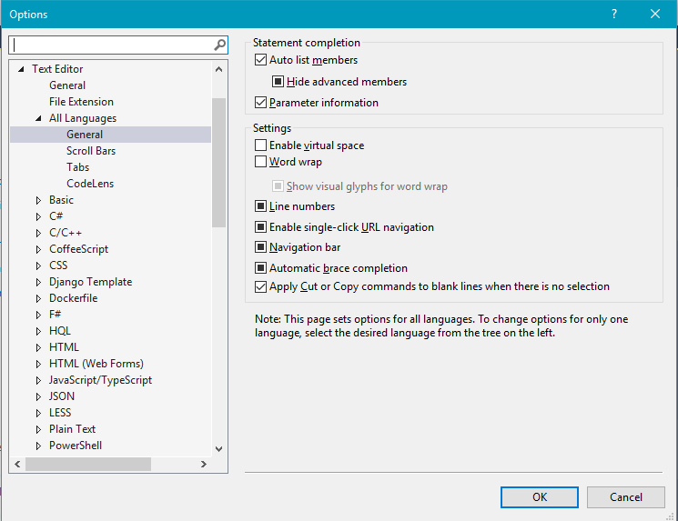

# Enable Line Numbers

## Description
Switch on line numbers for every language in your editor. Line numbers are disabled by default. Line numbers will not be in your clipboard if you copy and paste a bunch of lines.

## Guidance
1. Open up the settings dialog. 
2. Navigate to Text Editor --> All Languages --> General.
3. Check the box for line numbers.

