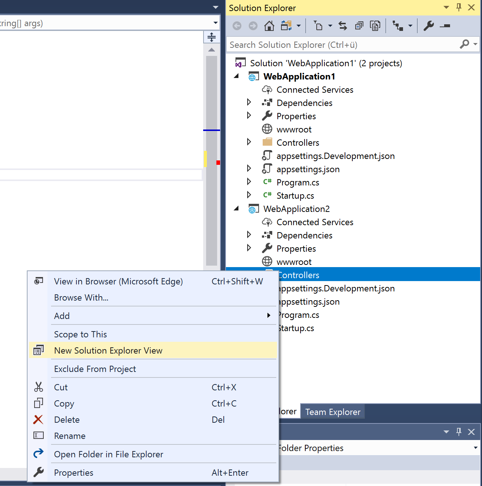

# Solution Explorer Views

## Description
If you work with multiple monitors you might want to create a new Solution Explorer View which can be docked as a tool window.

## Guidance

1. Open up a Visual Studio Solution.
2. Mark a solution, folder or a project in Solution Explorer. 
3. Right-click it and select "New Solution Explorer View". 

4. A new Solution Explorer instance will be created to display only items within the chosen scope.
5. You can dock this instance just as any other regular tool window.

