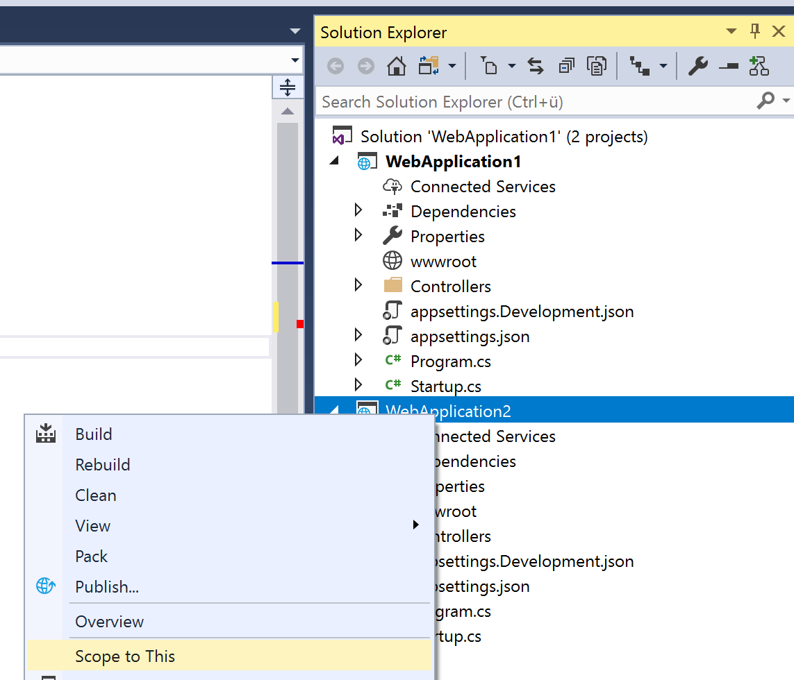
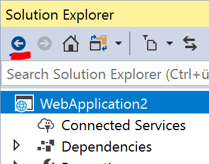

# Solution Explorer Scope

## Description
If you get lost in Solution Explorer you might want to scope it to the content which is relevant for you right now. This could be a single project or a folder. Everything else will be hidden. 

## Guidance

1. Open up a solution in Visual Studio.
2. Right click a project or a folder in Solution Explorer.
3. Select "Scope to this".

4. This will change the scope of the current Solution Explorer to the selected project or folder.
5. You can also use this multiple times and create scopes within scopes.
5. Use the navigation buttons in the Solution Explorer menu to naviate back and forward.

