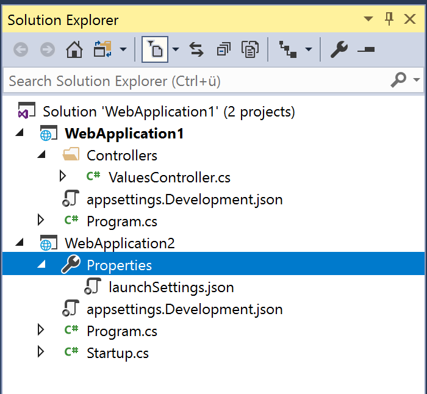

# Solution Explorer Filter

## Description
You can filter items in Solution Explorer. This way you only see the files you are currently interested in. This is not to be mixed up with unloading something. It really is just a filtered view. 

## Guidance
1. Open a solution.
2. In Solution Explorer menu search for the filter icon. 
3. You can chose if you want to see only items which have pending changes or only open files.

4. According to your choice the view will be filtered. 

