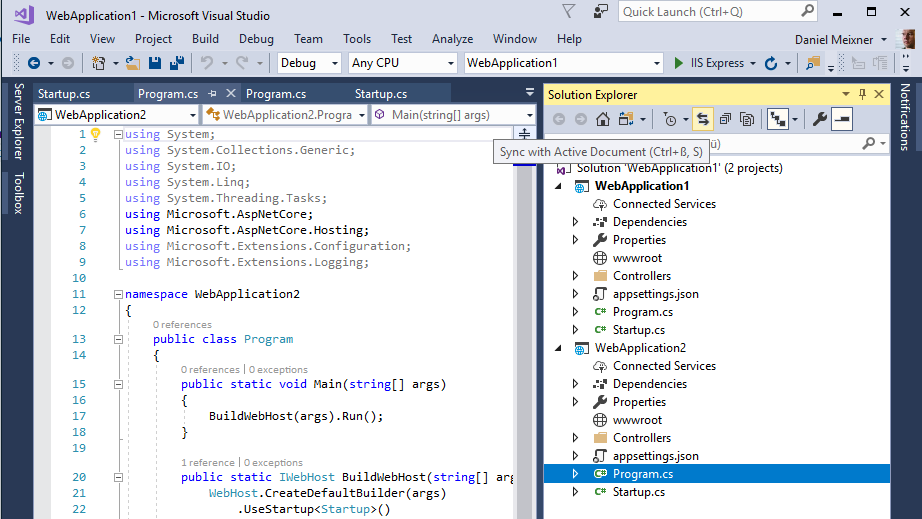

# Find active file in Solution Explorer

## Description
Use the "Sync with Active Document" button to find the current file in Solution explorer.

## Guidance
1. Open a solution
2. Open some files within your solution into your editor.
3. Click "Sync with Active Document" in the menu of solution explorer.
4. The currently active document will be marked in solution explorer. 

